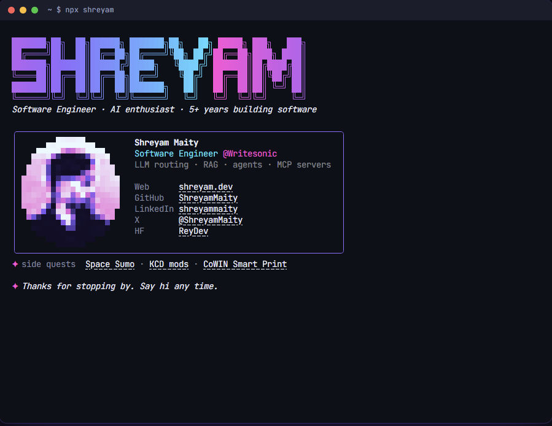

# npx shreyam

My business card, in your terminal. Run it with Node.js installed:

```bash
npx shreyam
```



## What it does

- The banner glitches in, the tagline types itself out, and my photo is drawn in half-block pixels.
- A menu of glitch-pop buttons: open my website or GitHub, see my latest project (fetched live from GitHub), play Space Sumo, show my email, or quit.
- On quit the menu dissolves and the plain card stays in your scrollback. Links are clickable in terminals that support them.
- No dependencies, so it starts fast.

## Controls

| Key | Action |
| --- | --- |
| `←` `→` `↑` `↓` or `h` `j` `k` `l` | Move between buttons |
| `Enter` / `Space` | Press the selected button |
| `1`–`6` | Press a button directly |
| `q` / `Esc` / `Ctrl+C` | Quit |

## Options

```bash
npx shreyam --static    # print the card once, no animation or menu
npx shreyam --json      # print the card details as JSON
NO_COLOR=1 npx shreyam  # no colors
```

When the output isn't a terminal (piped or in CI) it prints the static card automatically. Small windows get a compact layout.

## 🚨 Forking this repo (please read!)

I spent a lot of time designing this card and I'm proud of it. If you use it as a starting point, please put a **star** ⭐ on the repo and don't claim the work as your own ♥. Your details live in the `me` object at the top of `card.js`.

## Credits

The original card was inspired by [Anmol098](https://github.com/anmol098/) and [Write a Simple npx Business Card](https://studioelsa.se/blog/open-source-oss-npx-business-card).
